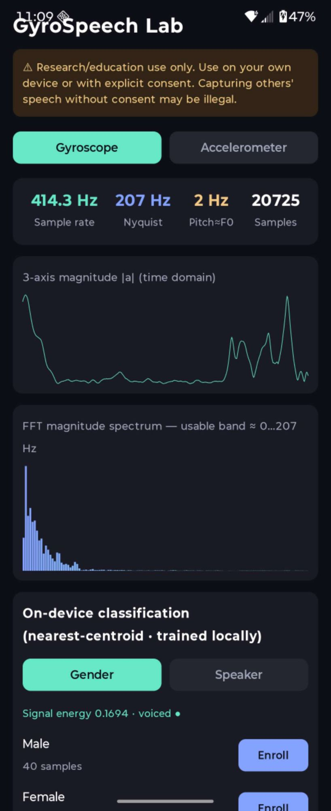

# GyroSpeech Lab (Android)

*English | [中文](README.zh-CN.md)*

A **research / educational** Android app that reproduces and visualizes the
*acoustic side-channel* of smartphone motion sensors — the phenomenon where a
MEMS **gyroscope** or **accelerometer** picks up sound-induced vibrations. It
implements milestones **M0, M2, and M4** of [`GYRO_SPEECH_APP_PLAN.md`](GYRO_SPEECH_APP_PLAN.md),
plus an offline training scaffold under [`training/`](training/).

> ⚠️ **For research, education, and defensive security only.** Use it on your
> own device or in experiments with explicit consent. Capturing other people's
> speech without consent may be illegal in your jurisdiction.

## Screenshot

<p align="center">
  
</p>

*Live gyroscope capture on a Motorola Razr+ (2024). With the
`HIGH_SAMPLING_RATE_SENSORS` permission the sampling rate reaches ~414 Hz
(Nyquist ~207 Hz) rather than the default Android 200 Hz cap — most of the
spectral energy still sits below ~100 Hz.*

## Features

- **M0 — Capture & visualize:** reads the gyroscope or accelerometer at the
  highest allowed rate (`SENSOR_DELAY_FASTEST`), shows the **real sampling
  rate**, Nyquist limit, dominant frequency, a live time-domain waveform, and an
  FFT magnitude spectrum. One tap records timestamped raw 3-axis data to **CSV**.
- **M2 — On-device classification:** enroll a few seconds per class on the
  device itself, then classify **gender** or **speaker** live with a
  nearest-centroid (cosine) classifier. No dataset, no network — the model
  trains on your own enrolled samples and persists across restarts.
- **M4 — Same-phone loudspeaker coupling → audible reconstruction:** plays a
  probe tone through the phone's own speaker while recording the accelerometer,
  then resynthesizes an **audible WAV** that follows the played audio's loudness
  and pitch envelope (a DSP baseline — prosody level, *not* word-level transcription).
- Built-in consent/compliance banner.

## What is (and isn't) possible

The physics ceiling is set by the sampling rate:

- Android 12+ caps motion sensors at **200 Hz** by default; holding the
  `HIGH_SAMPLING_RATE_SENSORS` permission (declared by this app) can lift it
  where the hardware allows — e.g. ~414 Hz measured on a Razr+ (2024). Even so,
  speech intelligibility lives mostly at 1–4 kHz, far above what these sensors
  sample, and most captured energy stays below ~100 Hz.

| Task | Sensor | Source | Feasibility |
|---|---|---|---|
| Gender classification | gyro / accel | airborne | ✅ high |
| Speaker ID (small closed set) | gyro / accel | airborne | ✅ medium-high |
| Isolated keywords | gyro | airborne | ⚠️ limited |
| Continuous waveform reconstruction | **accel** | **phone's own loudspeaker** | ⚠️ partial |
| Verbatim transcription of arbitrary speech | any | airborne | ❌ not feasible today |

## Build & run

Requires the Android SDK.

**A. Android Studio (recommended)**
1. `File → Open` this directory.
2. Wait for Gradle sync, connect a **physical device** (an emulator has no real
   sensor noise).
3. Run ▶.

**B. Command line**
```bash
# Point to your SDK (or set ANDROID_HOME)
echo "sdk.dir=$HOME/Library/Android/sdk" > local.properties
./gradlew assembleDebug
./gradlew installDebug      # device connected with USB debugging enabled
```
Output: `app/build/outputs/apk/debug/app-debug.apk`

## Usage

1. **M0:** lay the phone flat on a desk, speak toward the surface or play audio
   out loud, and watch the waveform / spectrum react. Note the real sampling
   rate at the top. Tap record to save CSV.
2. **M2:** pick *Gender* or *Speaker*, tap **Enroll** for a class and have that
   person speak toward the desk for ~4 s. After ≥ 2 classes are enrolled, it
   classifies live with confidence bars.
3. **M4:** tap **Probe + capture 5s** (or **Capture only** while external audio
   plays), then **Reconstruct WAV** and **Play**.

Export recorded CSV / reconstructed WAV:
```bash
adb pull /sdcard/Android/data/com.research.gyrospeech/files/
```

## Offline training (ML reconstruction)

The on-device M4 is a DSP baseline. To go further, [`training/`](training/)
contains a PyTorch scaffold that learns an accelerometer-spectrogram →
speech-spectrogram mapping (U-Net) and resynthesizes audio with Griffin-Lim.
See [`training/README.md`](training/README.md). It requires you to collect
paired data and train — there is no downloadable pre-trained model, and
word-level intelligibility needs substantial data and GPU training.

## Project layout

```
app/src/main/java/com/research/gyrospeech/
  SensorRecorder.kt    sensor capture, real-rate measurement, CSV + capture buffer
  Fft.kt               radix-2 FFT → magnitude spectrum
  FeatureExtractor.kt  window → 36-dim feature vector
  Classifier.kt        nearest-centroid classifier with JSON persistence
  AudioLab.kt          probe playback + accel → audible WAV reconstruction
  MainActivity.kt      Jetpack Compose UI
training/              Python U-Net training scaffold
GYRO_SPEECH_APP_PLAN.md  full technical plan and feasibility analysis
```

## Toolchain

Kotlin 2.0.21 · AGP 8.7.2 · Gradle 8.11.1 · compileSdk 35 · minSdk 26 · Jetpack Compose

## License

[MIT](LICENSE)
